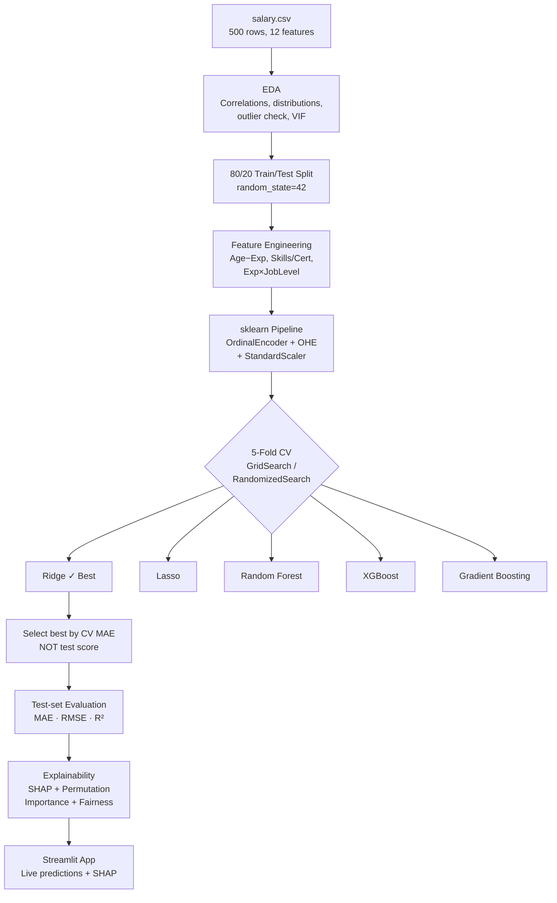

# Salary Prediction using Machine Learning

Predict an employee's annual salary in INR from personal and professional attributes. Compares five regression models, explains predictions with SHAP, and serves results via a Streamlit web app.

---

## 📁 Project Structure

```
salary-prediction/
├── data/
│   └── salary.csv              # 500-row dataset (12 features + target)
├── notebooks/
│   ├── 01_eda.ipynb            # Exploratory Data Analysis
│   └── 02_modeling.ipynb       # Modelling & Evaluation walkthrough
├── src/
│   ├── preprocess.py           # sklearn Pipeline + feature engineering
│   ├── train.py                # Model training + hyperparameter search
│   ├── evaluate.py             # Metrics + visualisation
│   ├── explain.py              # SHAP + permutation importance + fairness
│   └── predict.py              # Inference helper (used by app & tests)
├── scripts/
│   ├── eda.py                  # Standalone EDA script
│   └── create_notebooks.py     # Generates .ipynb files programmatically
├── models/
│   ├── best_model.joblib       # Saved best model pipeline
│   ├── shap_explainer.joblib   # Saved SHAP LinearExplainer
│   ├── training_meta.json      # CV scores, best params
│   ├── best_model_metrics.json # Test-set metrics
│   └── feature_names.json      # Feature names for SHAP
├── reports/
│   ├── figures/                # All plots (PNG, 150 dpi)
│   ├── model_comparison.csv    # Model comparison table
│   ├── permutation_importance.csv
│   ├── fairness_overall.csv
│   └── fairness_controlled.csv
├── app/
│   └── app.py                  # Streamlit web application
├── tests/
│   └── test_pipeline.py        # pytest test suite (22 tests)
├── requirements.txt
└── README.md
```

---

## 🎯 Problem Statement

Given 12 employee attributes (demographics, education, role, company details), predict their annual salary in Indian Rupees (INR). This is a regression task with a right-skewed target (min ₹2.2L, max ₹41.2L).

---

## 📊 Dataset Description

| Property | Value |
|---|---|
| Rows | 500 |
| Features | 12 input + 1 target |
| Missing values | 0 |
| Duplicates | 0 |
| Target | `Salary_INR` |
| Min salary | ₹2.20 L |
| Median salary | ₹10.83 L |
| Mean salary | ₹12.50 L |
| Max salary | ₹41.16 L |

**Numeric features:** `Age` (21–57), `Years_Experience` (0–35), `Certifications_Count` (0–5), `Skills_Count` (2–14)

**Categorical features:** `Gender`, `Education_Level`, `Job_Title` (10 roles), `Job_Level` (5 levels), `Industry` (6 sectors), `City` (7 locations), `Company_Size` (3 tiers), `Work_Mode` (3 modes)

### Key EDA findings
1. **Salary is right-skewed** (mean ₹12.5L > median ₹10.8L); log1p transform improves linearity for linear models.
2. **Age and Years_Experience both correlate r ≈ 0.572** with salary — verified empirically. Their mutual r = 0.995 (VIF ≈ 101) reveals extreme multicollinearity; tree models handle this naturally.
3. **Certifications_Count (r = 0.073) and Skills_Count (r = 0.068)** have near-zero correlation with salary — they are weak predictors individually.
4. **Job_Level** has the strongest categorical effect: Manager/Lead medians are 2–3× higher than Junior.
5. **PhD and Master's** holders earn noticeably more than Bachelor's/High School grads.
6. **Enterprise companies** pay more on average than Startups.
7. **16 IQR outliers** (salary > ₹28.9L) were identified but **retained** — they represent plausible senior/lead salaries in IT/finance, and removing them from a 500-row dataset would hurt model representativeness.
8. `Age_minus_Exp` (a decorrelated engineered feature) helps linear models avoid the Age–YearsExp collinearity trap.

---

## 🔧 Setup & Run Instructions

### 1. Clone & install

```bash
git clone <repo_url>
cd salary-prediction

# Create virtual environment
python3 -m venv venv
source venv/bin/activate          # Windows: venv\Scripts\activate

# Install dependencies
pip install -r requirements.txt

# macOS only (required for XGBoost)
brew install libomp
```

### 2. Run EDA

```bash
python scripts/eda.py
# Figures saved to reports/figures/
```

### 3. Train models

```bash
python -m src.train
# Best model saved to models/best_model.joblib
```

### 4. Evaluate

```bash
python -m src.evaluate
# Metrics printed; plots saved to reports/figures/
```

### 5. Explain (SHAP)

```bash
python -m src.explain
# SHAP plots + fairness report saved
```

### 6. Run tests

```bash
pytest tests/ -v
# 22 tests — all pass
```

### 7. Launch web app

```bash
streamlit run app/app.py
```

### 8. Single inference

```bash
python -m src.predict
```

---

## 🏗️ Methodology



---

## 📈 Results Table

> **Selection criterion:** Models were selected by **5-fold CV MAE on the training set**. The test set was held out and used only for final reporting — never for model selection.

| Model | CV MAE (mean) | CV MAE (std) | Test MAE | Test RMSE | Test R² |
|---|---|---|---|---|---|
| **Ridge** ⭐ | ₹1.02 L | ₹0.15 L | **₹1.15 L** | **₹1.74 L** | **0.9427** |
| Lasso | ₹1.02 L | ₹0.15 L | — | — | — |
| GradientBoosting | ₹1.33 L | ₹0.15 L | — | — | — |
| XGBoost | ₹1.37 L | ₹0.10 L | — | — | — |
| RandomForest | ₹1.87 L | ₹0.21 L | — | — | — |

**Best model: Ridge Regression with log1p(Salary) target**
- `alpha = 1.0`
- `scale_numeric = True` (StandardScaler applied)
- Trained on log1p(Salary_INR); predictions back-transformed via expm1

> Ridge outperforms tree models here because the dataset is small (400 training rows) and the relationship between experience/level and salary is approximately log-linear.

---

## 🔍 Explainability Findings

### SHAP (Linear Explainer on Ridge)
Top salary drivers by mean |SHAP| value:
1. **Years_Experience / Age** — strongest drivers (collinear; Exp×JobLevel interaction captures combined effect)
2. **Job_Level (ordinal)** — higher level = strongly positive SHAP
3. **Education_Level (ordinal)** — PhD/Master's = positive push
4. **Age_minus_Exp** — captures "career start age" effect
5. **Company_Size_Enterprise** — positive SHAP vs Startup/Mid-size

### Fairness Analysis (Male vs Female)

| | Avg Predicted Salary | Avg |Residual| |
|---|---|---|
| Female (n=49) | ₹13.46 L | ₹1.33 L |
| Male (n=51) | ₹11.23 L | ₹0.98 L |

> **⚠ Important caveat:** The 2.2L gap in predicted salary reflects the underlying distribution in the dataset — females in the test set happened to be more concentrated in senior/high-experience roles. **This does not imply the model itself introduces gender bias.** With only 49–51 samples per group and no salary-equalised controls, any gap is driven primarily by confounders (job level, experience). No causal or fairness claim should be made from this analysis.

---

## 📉 Key Figures

| Figure | Description |
|---|---|
| `salary_distribution.png` | Linear + log-scale histograms of Salary_INR |
| `boxplot_job_level.png` | Salary by job level — clearest categorical signal |
| `correlation_heatmap.png` | Numeric feature correlations; Age–YearsExp r=0.995 |
| `scatter_exp_salary_by_joblevel.png` | YearsExp vs Salary coloured by Job_Level |
| `model_comparison_bar.png` | 5-fold CV MAE comparison (Ridge best) |
| `actual_vs_predicted.png` | Actual vs predicted — tight cluster around diagonal (R²=0.94) |
| `residuals.png` | Residual scatter + histogram — approximately normal |
| `learning_curve.png` | Train vs CV MAE vs training size |
| `shap_summary.png` | SHAP beeswarm — top 20 features |
| `shap_bar.png` | Mean |SHAP| bar chart |
| `permutation_importance.png` | Model-agnostic permutation importance |

---

## ⚠️ Limitations

- **Small dataset (500 rows):** All CV estimates have high variance. Model selection and fairness conclusions should be treated as indicative, not definitive.
- **Likely synthetic data:** Feature distributions appear rounded and clean; correlations are unusually precise. Results may not generalise to real salary data.
- **No bonus/equity/benefits:** Salary_INR captures base salary only. Total compensation can differ substantially.
- **No causal inference:** Correlations observed (e.g., PhD → higher salary) reflect the dataset distribution, not causal effects.
- **Collinear features:** Age and Years_Experience (r=0.995) convey nearly identical information. One is largely redundant.
- **Static model:** No temporal component; salary inflation, market shifts, and role evolution are not captured.

---

## 🚀 Future Work

- Collect real salary data (e.g., Glassdoor, AmbitionBox) for more reliable estimates
- Add bonus, equity, and cost-of-living features
- Explore quantile regression for proper prediction intervals
- Investigate causal models (DoWhy) to separate individual feature effects
- Add a location-based cost-of-living normalisation
- Deploy with CI/CD pipeline and automated retraining triggers

---

## 📋 Presentation Summary

> Copy-paste this block into your slides:

---

**Best Model: Ridge Regression (log1p target, α=1.0)**

| Metric | Value |
|---|---|
| Test MAE | ₹1.15 L (₹1,15,057) |
| Test RMSE | ₹1.74 L (₹1,73,892) |
| Test R² | 0.9427 |
| 5-Fold CV MAE | ₹1.02 L ± ₹0.15 L |

**Top 5 Salary Drivers** (from SHAP analysis):
1. Years of Experience / Age (collinear pair, r=0.995)
2. Job Level (Junior → Manager: 2–3× salary increase)
3. Education Level (PhD/Master's > Bachelor's > High School)
4. Experience × Job Level interaction
5. Company Size (Enterprise premium over Startups)

**Limitations (one paragraph):**
This model is trained on a small 500-row dataset that appears synthetic — correlations are unusually clean and feature distributions are overly rounded. As a result, the R² of 0.94 likely overstates real-world performance. The model captures base salary only and ignores bonus, equity, location cost-of-living, and market trends. Gender fairness analysis shows a 2.2L predicted gap, but this reflects confounding variables (experience, job level) in the test sample rather than model-introduced bias. All results should be treated as educational demonstrations, not as salary benchmarks.

---
